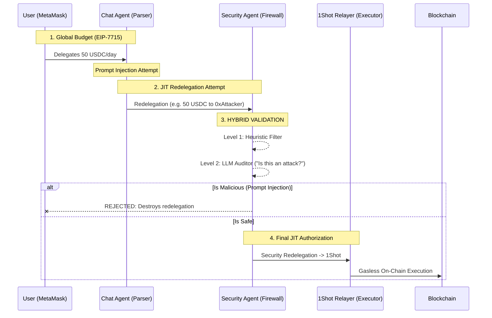
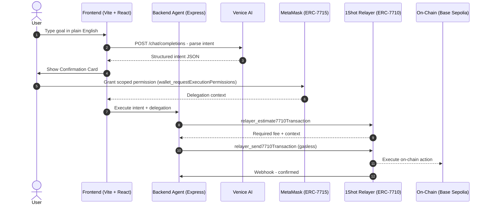

# GlassVault

<div align="center">

[](https://github.com/JaDi03/GlassVault/actions)
[](https://github.com/JaDi03/GlassVault)
[](./LICENSE)
[](https://nodejs.org)

[](https://metamask.io)
[](https://1shotapi.com)
[](https://venice.ai)

**_Your personal on-chain finance agent - private, gasless, and multi-chain._**

> **TL;DR:** GlassVault lets you control your on-chain wallet in plain English.
> Tell it "swap 0.01 ETH for USDC" and it parses your intent with Venice AI,
> asks for your approval, then executes gaslessly using MetaMask Smart Accounts
> (ERC-7715 scoped permissions + ERC-7710 delegation via 1Shot relay) - no keys handed over, ever.

---

</div>

## Table of Contents

- [Key Features](#-key-features)
- [Hackathon Resource Integrations](#-hackathon-resource-integrations)
- [How It Works](#-how-it-works)
- [Supported Networks](#-supported-networks)
- [Quick Start](#-quick-start)
- [Project Structure](#-project-structure)
- [Tech Stack](#-tech-stack)

---

## 🚀 Hackathon Resource Integrations

GlassVault is built to showcase the bleeding edge of Ethereum account abstraction using the provided hackathon resources. Here is how we integrated each core component:

### 1. MetaMask Smart Accounts Kit & EIP-7715 (Advanced Permissions)

GlassVault is not just an AI interface; it is a **secure Multi-Agent orchestration engine** built on top of the [MetaMask Smart Accounts Kit](https://github.com/MetaMask/smart-accounts). To protect users against one of the biggest threats to Web3 AI (Prompt Injection), we implemented **Granular Transitive Permissions (EIP-7710/EIP-7715 Redelegation)**.

Instead of granting blanket execution permissions to a single agent, GlassVault utilizes a strict Just-In-Time (JIT) redelegation chain:

1. **EIP-7702 & EIP-7715 (User -> Chat Agent):** The user's standard EOA is dynamically wrapped into a `Stateless7702` virtual smart account. The user signs a periodic allowance (e.g., $50 USDC/day) granting restricted access to the **Chat Agent**.
2. **JIT Redelegation (Chat Agent -> Security Agent):** The Chat Agent parses the intent. Instead of executing, it dynamically *redelegates* the exact requested amount (Transfer + Relayer Fee) to the **Security Agent**.
3. **Security Firewall:** The Security Agent acts as an isolated firewall. It evaluates the prompt using heuristics and a secondary LLM to detect Prompt Injection attacks. If malicious, the redelegation is destroyed.
4. **Final Redelegation (Security Agent -> 1Shot Relayer):** If validated as safe, the Security Agent *redelegates* that exact sub-budget to the 1Shot Relayer.
5. **Gasless Execution:** The 1Shot API executes the final transaction on-chain, paying gas in USDC on behalf of the user.

#### Orchestration Workflow



---

## 🛠 How It Works



---

## 🌐 Supported Networks

| Network | Chain ID | Status | 1Shot Support |
|---|---|---|---|
| Base Sepolia | 84532 | Active | Full Support |


---

## 🚀 Quick Start

### Prerequisites
- Node.js >= 24
- MetaMask browser extension
- Venice AI API key
- 1Shot API account

### Installation
```bash
git clone https://github.com/JaDi03/GlassVault.git
cd GlassVault
npm install
cp .env.example .env
npm run dev
```

---

## 📁 Project Structure

```text
glassvault/
├── apps/
│   ├── web/                   - Vite + React frontend (UI, EIP-7715)
│   └── api/                   - Node.js Express backend (1Shot Relayer, AI)
├── packages/
│   └── shared/                - Shared TypeScript types
```

## 📄 License
[MIT](./LICENSE) - Copyright (c) 2026 GlassVault
