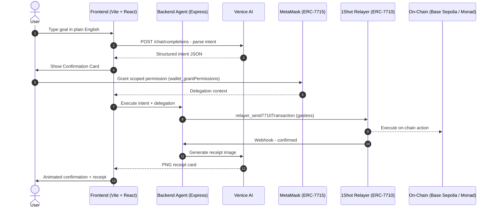

# GlassVault

<div align="center">

[](https://github.com/JaDi03/GlassVault/actions)
[](https://github.com/JaDi03/GlassVault)
[](./LICENSE)
[](https://nodejs.org)

[](https://metamask.io)
[](https://1shotapi.com)
[](https://venice.ai)

**_Your personal on-chain finance agent - private, gasless, and multi-chain._**

> **TL;DR:** GlassVault lets you control your on-chain wallet in plain English.
> Tell it "swap 0.01 ETH for USDC" and it parses your intent with Venice AI,
> asks for your approval, then executes gaslessly using MetaMask Smart Accounts
> (ERC-7715 scoped permissions + ERC-7710 delegation via 1Shot relay) - no keys handed over, ever.

---

</div>

## Table of Contents

- [Key Features](#-key-features)
- [How It Works](#-how-it-works)
- [Supported Networks](#-supported-networks)
- [Quick Start](#-quick-start)
- [Project Structure](#-project-structure)
- [Tech Stack](#-tech-stack)
- [License](#-license)

---

## Key Features

- **Plain English Interface**: Describe what you want - Venice AI parses it into a structured on-chain action.
- **Zero-Key Security**: You never hand over your private keys. MetaMask grants scoped, revocable ERC-7715 permissions per action.
- **Gasless Execution**: Every transaction is relayed by 1Shot API using ERC-7710 delegation - no ETH needed for gas.
- **Multi-Chain**: Base Sepolia and Monad Testnet supported, with cross-chain execution via `relayer_send7710TransactionMultichain`.
- **Autonomous API Payments**: The agent pays x402-gated data APIs using USDC micro-payments, no API key required.
- **Real-Time Feedback**: 1Shot webhook callbacks push live transaction status to the UI via Server-Sent Events.

---

## How It Works



1. User describes what they want in natural language.
2. Venice AI (`/chat/completions`) parses the intent into a typed `AgentIntent` object.
3. A confirmation card shows all action details before any signing.
4. MetaMask grants a scoped ERC-7715 permission with spend caps and time limits.
5. The backend agent submits the delegation bundle to the 1Shot relayer.
6. 1Shot executes the transaction gaslessly on-chain via ERC-7710.
7. A webhook callback triggers real-time UI updates via SSE.
8. Venice AI generates a visual receipt (`/images` endpoint).

---

## Supported Networks

| Network | Chain ID | Status | 1Shot Support |
|---|---|---|---|
| Base Sepolia | 84532 | Active | Server wallet configured |
| Monad Testnet | 10143 | Active | Server wallet configured |

---

## Quick Start

### Prerequisites

- Node.js >= 24 (see `.nvmrc`)
- Git
- MetaMask browser extension (Flask recommended for EIP-7702)
- Venice AI API key
- 1Shot API account with server wallets configured

### Installation

```bash
git clone https://github.com/your-org/glassvault.git
cd glassvault
npm install
```

### Configuration

```bash
cp .env.example .env
# Fill in your API keys and wallet addresses
```

### Development

```bash
# Run frontend + backend concurrently
npm run dev

# Or individually:
npm run dev:web   # http://localhost:5173
npm run dev:api   # http://localhost:3001
```

### Production Deployment (Vercel)

```bash
# Install Vercel CLI
npm i -g vercel

# Deploy
vercel --prod
```

---

## Project Structure

```
glassvault/
├── apps/
│   ├── web/                   - Vite + React frontend (Vercel static)
│   │   ├── src/
│   │   │   ├── components/    - UI components (added per phase)
│   │   │   ├── hooks/         - React hooks (added per phase)
│   │   │   ├── lib/           - Client utilities (added per phase)
│   │   │   ├── App.tsx        - Root component
│   │   │   ├── index.css      - Global design system
│   │   │   └── main.tsx       - React entry point
│   │   ├── index.html
│   │   └── vite.config.ts
│   │
│   └── api/                   - Node.js Express backend (Vercel Functions)
│       └── src/
│           └── index.ts       - Server entry point (routes added per phase)
│
├── packages/
│   └── shared/                - Shared TypeScript types
│       └── src/index.ts       - AgentIntent, TxStatus, ChainConfig, etc.
│
├── .github/workflows/ci.yml   - GitHub Actions CI pipeline
├── .env.example               - Environment variables template
├── .gitignore
├── .nvmrc                     - Node version lock (24)
├── vercel.json                - Vercel deployment config
└── package.json               - Monorepo workspace root
```

---

## Tech Stack

- **[Vite](https://vitejs.dev/)**: Frontend build tool and dev server.
- **[React 19](https://react.dev/)**: UI framework.
- **[TypeScript 5](https://www.typescriptlang.org/)**: Type safety across the monorepo.
- **[Express 4](https://expressjs.com/)**: Backend HTTP server and agent runtime.
- **[MetaMask SDK](https://docs.metamask.io/sdk/)**: Wallet connection and ERC-7715 permissions.
- **[viem](https://viem.sh/)**: Type-safe Ethereum client for ABI encoding.
- **[Venice AI](https://docs.venice.ai/)**: Privacy-first LLM for NLP intent parsing and image receipt generation.
- **[1Shot API](https://1shotapi.com/docs/)**: ERC-7710 gasless transaction relay with webhook callbacks.
- **[x402 Protocol](https://x402.org/)**: Autonomous HTTP payment standard for API monetization.

---

## License

[MIT](./LICENSE) - Copyright (c) 2026 GlassVault
