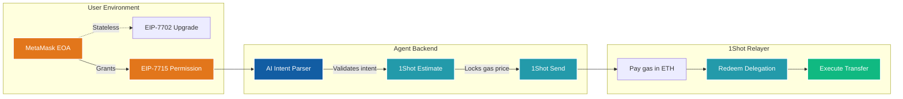
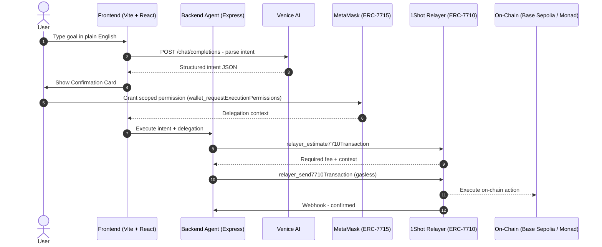

# GlassVault

<div align="center">

[](https://github.com/JaDi03/GlassVault/actions)
[](https://github.com/JaDi03/GlassVault)
[](./LICENSE)
[](https://nodejs.org)

[](https://metamask.io)
[](https://1shotapi.com)
[](https://venice.ai)

**_Your personal on-chain finance agent - private, gasless, and multi-chain._**

> **TL;DR:** GlassVault lets you control your on-chain wallet in plain English.
> Tell it "swap 0.01 ETH for USDC" and it parses your intent with Venice AI,
> asks for your approval, then executes gaslessly using MetaMask Smart Accounts
> (ERC-7715 scoped permissions + ERC-7710 delegation via 1Shot relay) - no keys handed over, ever.

---

</div>

## Table of Contents

- [Key Features](#-key-features)
- [Hackathon Resource Integrations](#-hackathon-resource-integrations)
- [How It Works](#-how-it-works)
- [Supported Networks](#-supported-networks)
- [Quick Start](#-quick-start)
- [Project Structure](#-project-structure)
- [Tech Stack](#-tech-stack)

---

## 🚀 Hackathon Resource Integrations

GlassVault is built to showcase the bleeding edge of Ethereum account abstraction using the provided hackathon resources. Here is how we integrated each core component:

### 1. MetaMask Smart Accounts Kit & EIP-7715 (Advanced Permissions)
Instead of forcing users to sign every single transaction or give up their private keys, GlassVault uses the **MetaMask Smart Accounts Kit** to request **Advanced Permissions (EIP-7715)**. 
- **How it works:** When you connect your wallet, GlassVault calls `wallet_requestExecutionPermissions`. MetaMask opens a native, human-readable popup asking the user to authorize a specific scoped action (e.g., `erc20-token-periodic` for USDC transfers).
- **Result:** The Agent receives a cryptographic `PermissionContext` that allows it to execute on behalf of the user, strictly within the boundaries set by the user.

### 2. ERC-7710 Delegation & 1Shot Relayer (Gasless Execution)
Once the Agent has the permission context, it needs to execute the transaction without making the user pay for gas. We achieve this using the **1Shot API** and **ERC-7710 (Delegated Transactions)**.



- **How it works:** 
  1. The backend uses `relayer_estimate7710Transaction` to dynamically calculate the fee in USDC.
  2. The backend batches the *Fee Transfer* and the *User's Target Transfer* together.
  3. It sends this batch to `relayer_send7710Transaction` along with the EIP-7715 permission context.
  4. The 1Shot Relayer pays the ETH gas fee on-chain, executes `Redeem Delegations`, takes its USDC fee, and executes the user's intent.

---

## 🛠 How It Works



---

## 🌐 Supported Networks

| Network | Chain ID | Status | 1Shot Support |
|---|---|---|---|
| Base Sepolia | 84532 | Active | Full Support |
| Monad Testnet | 10143 | Soon | - |

---

## 🚀 Quick Start

### Prerequisites
- Node.js >= 24
- MetaMask browser extension
- Venice AI API key
- 1Shot API account

### Installation
```bash
git clone https://github.com/JaDi03/GlassVault.git
cd GlassVault
npm install
cp .env.example .env
npm run dev
```

---

## 📁 Project Structure

```text
glassvault/
├── apps/
│   ├── web/                   - Vite + React frontend (UI, EIP-7715)
│   └── api/                   - Node.js Express backend (1Shot Relayer, AI)
├── packages/
│   └── shared/                - Shared TypeScript types
```

## 📄 License
[MIT](./LICENSE) - Copyright (c) 2026 GlassVault
